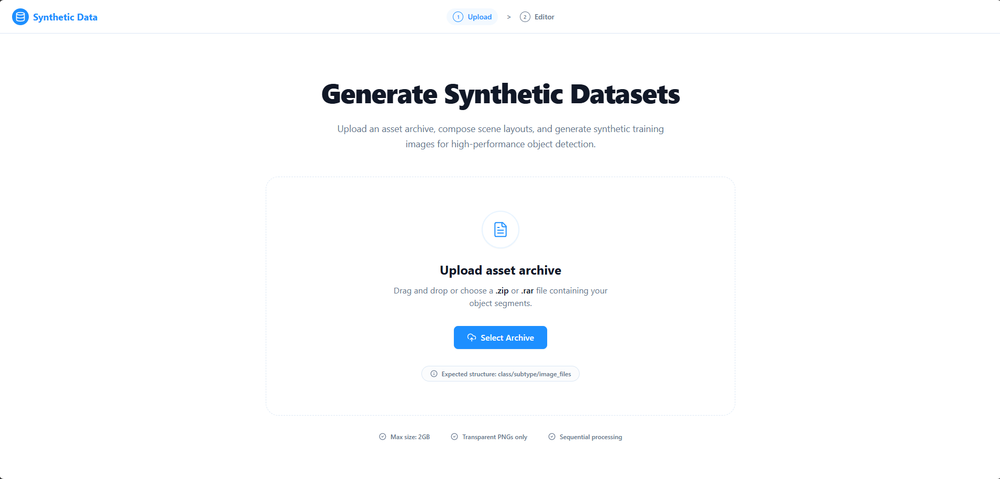
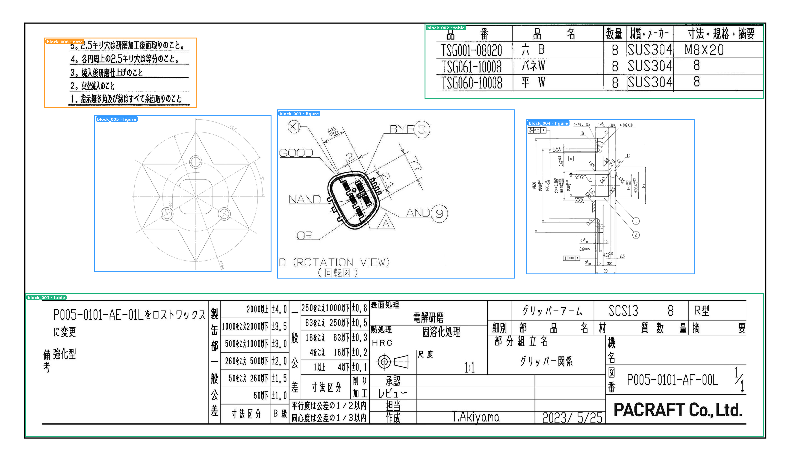
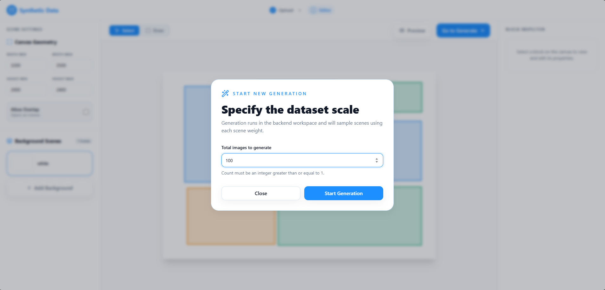
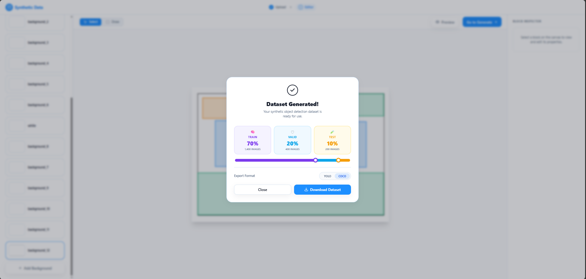

# SyntheticDataset App

A web application for visually designing layout templates and generating **synthetic, labelled datasets** from local document assets.


---

## Overview

SyntheticDataset App solves the problem of **data scarcity** for document-layout learning workflows. Instead of manually annotating thousands of real-world images, you design a *layout template* — specifying where object typically appear on a page — and the engine automatically composites your existing asset library onto realistic document backgrounds to produce as many labelled training images as you need.

The entire workflow lives in a single browser tab:

1. **Upload assets** (transparent PNGs of object)
2. **Design scenes** — draw regions on a canvas, assign a label/class, tune capacity & augmentation per block
3. **Preview** — generate one realistic sample image instantly
4. **Generate** — produce hundreds or thousands of labelled images in the background
5. **Export** — download as a ZIP archive (currently supports YOLO-style and COCO-style annotations)

## Key Features

| Feature | Details |
|---|---|
| **Visual Canvas Editor** | Drag-to-draw blocks on a Konva.js canvas with live background preview |
| **Multi-Scene Support** | Define multiple background scenes with independent block layouts and scene weights |
| **Auto-Save** | Template state is saved automatically before previews, scene switches, and generation |
| **Real Preview** | Preview generates an actual composite image (not just wireframe boxes) using the same engine as the final dataset |
| **Background Management** | Upload custom backgrounds; deleted scenes are physically removed from the server |
| **Export Formats** | Export datasets with YOLO-style labels **or** COCO JSON (`instances_default.json`) |
| **Async Generation** | Long-running jobs execute in a background thread with live progress polling |
| **Asset Augmentation** | Per-block random rotation, blur, noise, scale jitter, and placement anchoring |

---

## Getting Started

### Prerequisites

- Python ≥ 3.10
- Node.js ≥ 18
- A `.venv` virtual environment at the repo root

### 1. Install backend dependencies

```bash
python -m venv .venv
source .venv/bin/activate
python3 -m pip install -r backend/requirements.txt
```

### 2. Install frontend dependencies

```bash
cd frontend
npm install
```

### 3. Prepare your assets

Place your foreground assets under `backend/tmp/synth_app/assets/` following this structure:

```
assets/
  figure/
    compact_diagram/
      001.png
    wide_diagram/
      002.png
  table/
    wide_strip/
      001.png
  note/
    medium_note/
      001.png
```

- **Top-level folder** = label/class name (e.g. `figure`, `table`, `note`)
- **Sub-folder** = internal subtype (used for filtering in block settings)
- Transparent PNGs give the cleanest results; opaque images are also supported

### 4. Run the backend

```bash
# From the repo root
.venv/bin/python -m uvicorn backend.app.main:app --host 127.0.0.1 --port 8000
```

Add `--reload` during development to pick up Python changes automatically.

### 5. Run the frontend

```bash
cd frontend
npm run dev -- --host 127.0.0.1 --port 5173
```

Open [http://127.0.0.1:5173](http://127.0.0.1:5173) in your browser.

---

## Some Demo Images
### Upload assets 
 

### Design layout blocks 
 

### Preview a generated sample 
 

### Configure and launch generation 
 

### Completed job and export 
 

---
